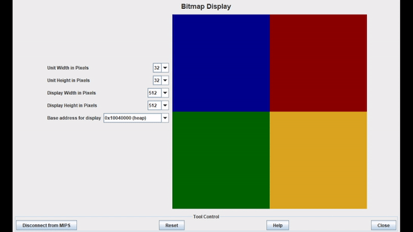

<h1 align="center">Projeto Genius</h1>

Clássico jogo Genius implementado no MARS MIPS Simulator.

 <a href="#objetivo">Objetivo</a> •
 <a href="#demonstração">Demonstração</a> • 
 <a href="#tecnologias">Tecnologias</a> • 
 <a href="#requisitos">Requisitos</a> • 
 <a href="#status-do-projeto">Status do Projeto</a> • 
 <a href="https://github.com/Samuelvidal99/projeto-genius/blob/main/LICENSE">Licença</a> • 
 <a href="#autores">Autores</a>

<h1>Objetivo</h1>
<p1>Esse projeto foi desenvolvido como uma atividade avaliativa da disciplina de Arquitetura e Organização de Computadores na UFRPE (Universidade Federal Rural de Pernambuco), e teve como objetivo o aprendizado da linguagem Assembly implementada por meio do MARS MIPS simulator, uma IDE leve para programação na linguagem Assembly MIPS, as seguintes teclas foram utilizadas como input:   1. Azul	:blue_square: 2. Vermelho :red_square: 3. Verde :green_square: 4. Amarelo :yellow_square:.</p1>

<h1>Demonstração</h1>

<h1 align='center'></img></h1>

<h1>Tecnologias</h1>

As seguintes ferramentas foram usadas na construção do projeto:

- [MARS MIPS Simulator](http://courses.missouristate.edu/kenvollmar/mars/index.htm)

<h1>Requisitos</h1>
<p1>Para utilizar essa aplicação basta baixar o <a href=http://courses.missouristate.edu/kenvollmar/mars/download.htm>simulador MARS MIPS</a>, abrir o arquivo <b>genius.asm</b>e seguir as seguintes instruções:  <pre>Para acessar a tela do jogo é preciso utilizar o Bitmap Display do MARS MIPS:

o jogador deve acessar a opção Tools->Bitmap Display, no canto superior direito do MARS, 

e na tela do Bitmap Display deve-se colocar as seguintes opções para melhor visualização do jogo:

Unit Width in Pixels: 32, Unit Height in Pixels: 32, Display Width in Pixels: 512,
Display Height in Pixels: 512 e Base address for display: 0x10040000 (heap).

agora basta apertar o botão Connect to MIPS no display e executar o código.

assim o jogo está funcional e basta colocar os inputs já mencionados no terminal Run I/O.</pre></p1> 

<h1>Status do Projeto</h1>
<h4>Finalizado :white_check_mark:</h4>

<h1>Autores</h1>
<a href="https://github.com/Samuelvidal99"><b>Samuel Vidal</b></a>  
Feito por <b>Samuel Vidal</b>, Entre em contato por: 

<a href="https://github.com/nicole-pereira"><b>Nicole Pereira</b></a>  
Feito por <b>Nicole Pereira</b>, Entre em contato por: 

<a href="https://github.com/aldenirtelles"><b>Aldenir Telles</b></a>  
Feito por <b>Aldenir Telles</b>, Entre em contato por: 

<a href="https://github.com/clararomeiro"><b>Ana Clara Romeiro</b></a>  
Feito por <b>Ana Clara Romeiro</b>, Entre em contato por: 

